# Jira SM-пайплайн — полная схема

Story- и Bug-циклы, как реализованы в `.dmtools/agents/sm.json`. Подробности
и найденные баги — в `.dmtools/README.md`.

```mermaid
flowchart TD
    Idea([Идея владельца]) --> Epic[Epic в Backlog]
    Epic --> Intake["intake.json\nразбивка на Story"]
    Intake --> Questions["story_questions.json"]
    Questions --> BA["story_ba_check → BA Analysis\nstory_acceptance_criteria"]
    BA --> Solution["story_solution.json\nSolution Architecture"]
    Solution --> RFD[Ready For Development]

    RFD --> Dev["story_development.json\nClaude пишет код"]
    Dev --> PR1[PR открыт]
    PR1 --> Review1["pr_review.json"]
    Review1 -->|REQUEST_CHANGES| Rework1["pr_rework.json"]
    Rework1 --> Review1
    Review1 -->|APPROVE| Merge1["retry_merge.json"]
    Merge1 --> Merged[Story: Merged]

    Merged --> TCGen["test_cases_generator.json\nсоздаёт Test Case тикеты"]
    TCGen --> RFT[Ready For Testing]
    RFT --> StoryTA["story_test_automation.json\nClaude пишет Playwright"]
    StoryTA --> TestPR[Test PR открыт]
    TestPR --> TAReview["pr_story_test_automation_review.json"]
    TAReview -->|REQUEST_CHANGES\nтест-код неверный| TARework["story_test_automation_rework.json"]
    TARework --> TAReview
    TAReview -->|APPROVE| TAMerge["story_test_automation_merge.json"]
    TAMerge --> TCStatus{Все TC Passed?}

    TCStatus -->|Да| StoryDone["story_done_check.json"]
    StoryDone --> Done([Story: Done])

    TCStatus -->|Есть Failed| BugCreate["bulk_bugs_creation.json\nсоздаёт Bug, линкует к TC"]
    BugCreate --> BugToFix[Story/TC: Bug To Fix]
    BugCreate --> BugRFD[Bug: Ready For Development]

    BugRFD --> BugDev["bug_development.json\nRCA + fix + reproduction test"]
    BugDev --> PR2[Bug PR открыт]
    PR2 --> Review2["pr_review.json\n(тот же job, Story+Bug)"]
    Review2 -->|REQUEST_CHANGES| Rework2["pr_rework.json"]
    Rework2 --> Review2
    Review2 -->|APPROVE| Merge2["retry_merge.json"]
    Merge2 --> BugMerged["bug_merged.json\nRCA/prevention в Jira"]

    BugMerged --> BugRFT[Bug: Ready For Testing]
    BugRFT --> BugTCGen["bug_test_cases_generator.json\nнаходит/создаёт regression TC"]
    BugTCGen --> BugTA["bug_test_automation.json\nперепрогоняет TC против фикса"]
    BugTA --> BugTestPR{Нужен новый PR?}
    BugTestPR -->|Да, есть изменения| BugTAReview["pr_bug_test_automation_review.json"]
    BugTAReview -->|REQUEST_CHANGES| BugTARework["bug_test_automation_rework.json"]
    BugTARework --> BugTAReview
    BugTAReview -->|APPROVE| BugTAMerge["bug_test_automation_merge.json"]
    BugTestPR -->|Нет, TC уже\nпройден на месте| BugDoneCheck
    BugTAMerge --> BugDoneCheck["bug_done_check.json\nвсе linked TC passed?"]

    BugDoneCheck --> BugDone([Bug: Done])
    BugDone --> UnblockCheck["bug_to_fix_check.json\nвсе linked Bug Done?"]
    UnblockCheck -->|Да| Unblock["Story/TC → Ready For Testing\n(снова прогоняется через RFT)"]
    Unblock -.->|ре-тест| RFT

    style Idea fill:#e1f5e1
    style Done fill:#e1f5e1
    style BugDone fill:#ffe1e1
    style BugCreate fill:#ffe1e1
    style TCStatus fill:#fff4e1
```

## Ключевые точки решения

- **`pr_review.json` / `retry_merge.json` / `pr_rework.json`** — одни и те же
  job'ы обслуживают и Story, и Bug PR (JQL `issuetype in ('Story', 'Bug')`),
  не дублируются.
- **`TCStatus`** (все TC Passed?) — если хоть один TC в финальном `Failed`,
  `bulk_bugs_creation` подхватывает его на следующем SM-цикле и создаёт Bug;
  Story при этом уходит в `Bug To Fix` и ждёт, не проверяя остальные TC
  повторно.
- **`bug_test_cases_generator`** предпочитает найти существующий Test Case
  (`isFindRelated: true`) вместо создания дубликата — если баг был найден
  тем же TC, что и раньше, регрессия перепроверяется на нём же.
- **`BugTestPR`** — если `bug_test_automation` не внёс изменений в тест-код
  (TC уже актуален, просто перепрогнан), новый PR не создаётся и цикл сразу
  идёт на `bug_done_check`, минуя review/merge.
- **`Unblock`** — после Done Bug'а разблокированная Story/TC возвращается в
  `Ready For Testing`, что запускает **полный** ре-тест всех линкованных TC,
  не только тот, что был Failed — гарантия, что фикс не сломал остальное.

## Ссылки

- Полное описание, история находок и известные пробелы — `.dmtools/README.md`
- Job-конфиги — `.dmtools/agents/*.json`
- SM-правила (реальный источник этой схемы) — `.dmtools/agents/sm.json`
