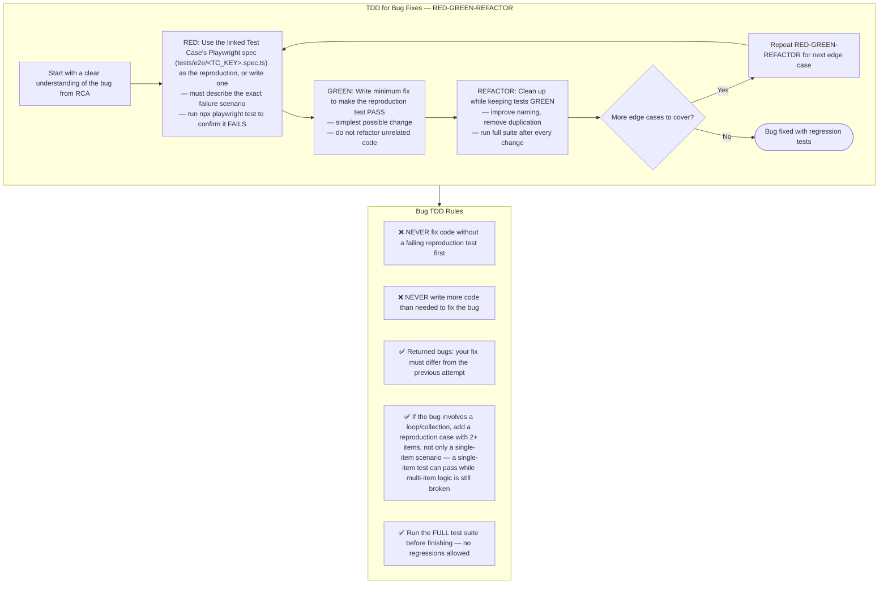

```mermaid
flowchart TD
    subgraph TDD["TDD for Bug Fixes — RED-GREEN-REFACTOR"]
        T0["Start with a clear understanding of the bug from RCA"]
        T1["RED: Use the linked Test Case's Playwright spec (tests/e2e/&lt;TC_KEY&gt;.spec.ts) as the reproduction, or write one<br/>— must describe the exact failure scenario<br/>— run npx playwright test to confirm it FAILS"]
        T2["GREEN: Write minimum fix to make the reproduction test PASS<br/>— simplest possible change<br/>— do not refactor unrelated code"]
        T3["REFACTOR: Clean up while keeping tests GREEN<br/>— improve naming, remove duplication<br/>— run full suite after every change"]
        T4{"More edge cases to cover?"}
        T5["Repeat RED-GREEN-REFACTOR for next edge case"]
        T0 --> T1 --> T2 --> T3 --> T4
        T4 -->|Yes| T5 --> T1
        T4 -->|No| DONE([Bug fixed with regression tests])
    end

    subgraph RULES["Bug TDD Rules"]
        R1["❌ NEVER fix code without a failing reproduction test first"]
        R2["❌ NEVER write more code than needed to fix the bug"]
        R3["✅ Returned bugs: your fix must differ from the previous attempt"]
        R4["✅ If the bug involves a loop/collection, add a reproduction case with 2+ items, not only a single-item scenario — a single-item test can pass while multi-item logic is still broken"]
        R5["✅ Run the FULL test suite before finishing — no regressions allowed"]
    end

    TDD --> RULES
```
