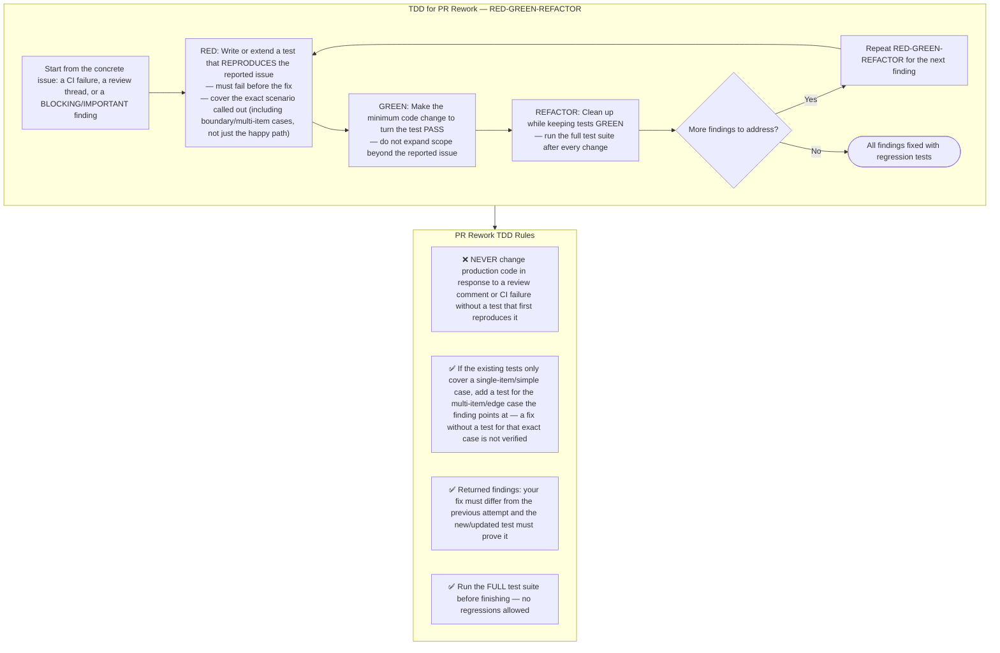

```mermaid
flowchart TD
    subgraph TDD["TDD for PR Rework — RED-GREEN-REFACTOR"]
        T0["Start from the concrete issue: a CI failure, a review thread, or a BLOCKING/IMPORTANT finding"]
        T1["RED: Write or extend a test that REPRODUCES the reported issue<br/>— must fail before the fix<br/>— cover the exact scenario called out (including boundary/multi-item cases, not just the happy path)"]
        T2["GREEN: Make the minimum code change to turn the test PASS<br/>— do not expand scope beyond the reported issue"]
        T3["REFACTOR: Clean up while keeping tests GREEN<br/>— run the full test suite after every change"]
        T4{"More findings to address?"}
        T5["Repeat RED-GREEN-REFACTOR for the next finding"]
        T0 --> T1 --> T2 --> T3 --> T4
        T4 -->|Yes| T5 --> T1
        T4 -->|No| DONE([All findings fixed with regression tests])
    end

    subgraph RULES["PR Rework TDD Rules"]
        R1["❌ NEVER change production code in response to a review comment or CI failure without a test that first reproduces it"]
        R2["✅ If the existing tests only cover a single-item/simple case, add a test for the multi-item/edge case the finding points at — a fix without a test for that exact case is not verified"]
        R3["✅ Returned findings: your fix must differ from the previous attempt and the new/updated test must prove it"]
        R4["✅ Run the FULL test suite before finishing — no regressions allowed"]
    end

    TDD --> RULES
```
