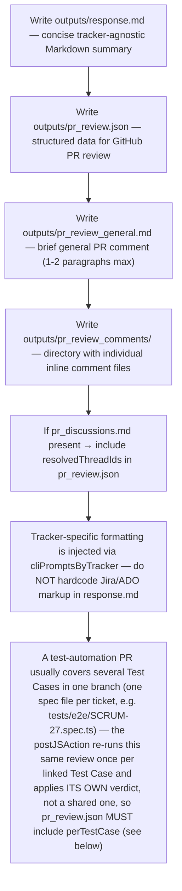

## perTestCase — required when the PR touches more than one Test Case

`pr_review.json` MUST include a `perTestCase` object mapping each Test Case's
ticket key to its own verdict, `"APPROVE"` or `"BLOCK"` — derived from that
Test Case's own spec file only, ignoring issues found in other files in the
diff:

```json
"perTestCase": {
  "SCRUM-25": "APPROVE",
  "SCRUM-26": "APPROVE",
  "SCRUM-27": "BLOCK"
}
```

- Key = the Test Case ticket key. Determine it from the spec file name
  (`tests/e2e/{KEY}.spec.ts`) for every Test Case ticket linked to this PR's
  parent Story, whether or not that Test Case's file changed in this diff —
  a ticket with no blocking issues in the diff is `"APPROVE"`.
- A single `BLOCKING` inline comment on a ticket's own file is enough to make
  that entry `"BLOCK"`; issues confined to a sibling ticket's file must NOT
  affect this ticket's entry.
- The top-level `recommendation` stays the overall PR verdict (BLOCK if ANY
  Test Case is BLOCK) — `perTestCase` is what actually drives each ticket's
  Jira status, so get it right per-file even when the overall verdict is
  BLOCK because of just one file.
