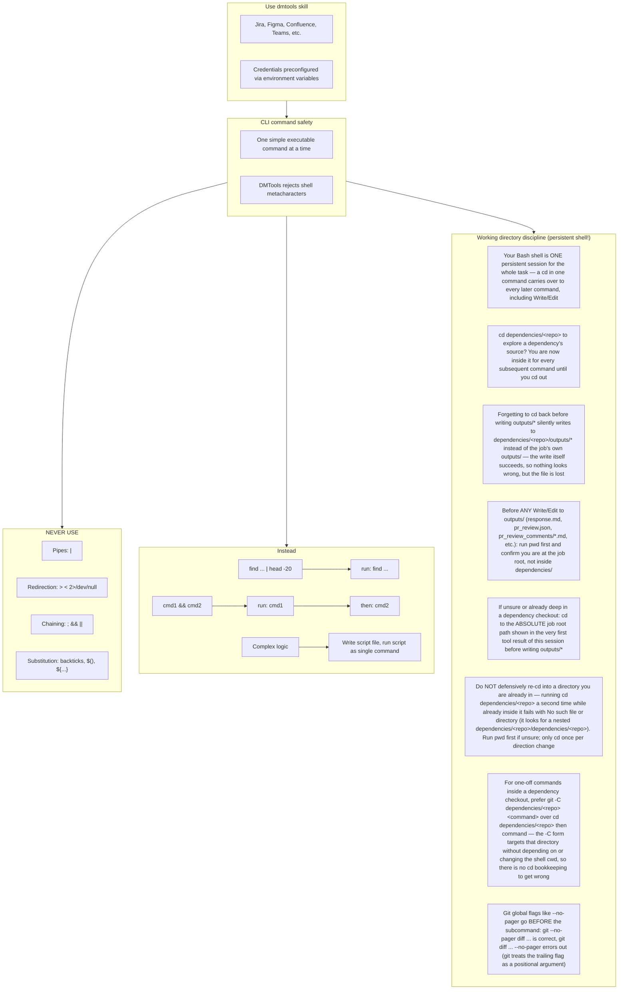

```mermaid
flowchart TD
    subgraph USE["Use dmtools skill"]
        U1["Jira, Figma, Confluence, Teams, etc."]
        U2["Credentials preconfigured via environment variables"]
    end

    subgraph SAFETY["CLI command safety"]
        S1["One simple executable command at a time"]
        S2["DMTools rejects shell metacharacters"]
    end

    subgraph FORBIDDEN["NEVER USE"]
        F1["Pipes: |"]
        F2["Redirection: > < 2>/dev/null"]
        F3["Chaining: ; && ||"]
        F4["Substitution: backticks, $(), ${...}"]
    end

    subgraph EXAMPLES["Instead"]
        E1["find ... | head -20"] --> E1a["run: find ..."]
        E2["cmd1 && cmd2"] --> E2a["run: cmd1"] --> E2b["then: cmd2"]
        E3["Complex logic"] --> E3a["Write script file, run script as single command"]
    end

    subgraph CWD["Working directory discipline (persistent shell!)"]
        C1["Your Bash shell is ONE persistent session for the whole task — a cd in one command carries over to every later command, including Write/Edit"]
        C2["cd dependencies/&lt;repo&gt; to explore a dependency's source? You are now inside it for every subsequent command until you cd out"]
        C3["Forgetting to cd back before writing outputs/* silently writes to dependencies/&lt;repo&gt;/outputs/* instead of the job's own outputs/ — the write itself succeeds, so nothing looks wrong, but the file is lost"]
        C4["Before ANY Write/Edit to outputs/ (response.md, pr_review.json, pr_review_comments/*.md, etc.): run pwd first and confirm you are at the job root, not inside dependencies/"]
        C5["If unsure or already deep in a dependency checkout: cd to the ABSOLUTE job root path shown in the very first tool result of this session before writing outputs/*"]
        C6["Do NOT defensively re-cd into a directory you are already in — running cd dependencies/&lt;repo&gt; a second time while already inside it fails with No such file or directory (it looks for a nested dependencies/&lt;repo&gt;/dependencies/&lt;repo&gt;). Run pwd first if unsure; only cd once per direction change"]
        C7["For one-off commands inside a dependency checkout, prefer git -C dependencies/&lt;repo&gt; &lt;command&gt; over cd dependencies/&lt;repo&gt; then command — the -C form targets that directory without depending on or changing the shell cwd, so there is no cd bookkeeping to get wrong"]
        C8["Git global flags like --no-pager go BEFORE the subcommand: git --no-pager diff ... is correct, git diff ... --no-pager errors out (git treats the trailing flag as a positional argument)"]
    end

    USE --> SAFETY
    SAFETY --> FORBIDDEN
    SAFETY --> EXAMPLES
    SAFETY --> CWD
```

