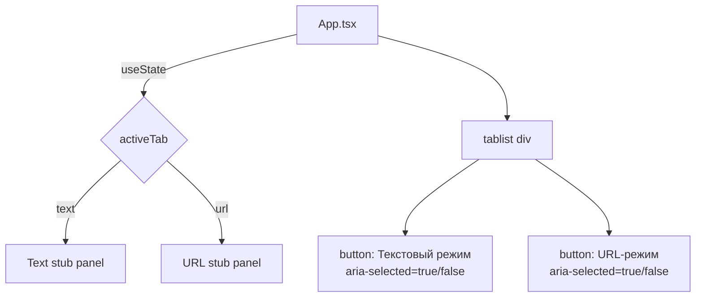

### What changed

Replaced the default Vite scaffold in `src/App.tsx` with a tabbed app shell: heading "Semantic Relevance Analyzer" + two tab buttons ("Текстовый режим" / "URL-режим") with stub panels, using Tailwind `max-w-4xl mx-auto` layout. Cleared all Vite-specific styles from `src/App.css`, keeping only active/inactive tab highlight classes using existing `--accent` CSS variables.

### Key decisions

- Tab state held in `App` via `useState<'text' | 'url'>` — no external state library needed for two tabs
- Active tab uses `aria-selected` for accessibility; styling via `.active-tab` / `.inactive-tab` CSS classes referencing existing `--accent` CSS variables from `index.css`
- Switched `vitest.config.ts` environment from `node` to `happy-dom` and added `@vitejs/plugin-react` to enable JSX rendering in tests
- Installed `@testing-library/react`, `@testing-library/user-event`, and `happy-dom` as dev dependencies
- Explicit `afterEach(cleanup)` prevents DOM accumulation across tests

### How to verify

```bash
npx vitest run test/App.test.tsx
```

All 5 new tests pass; full suite: 51 passed, 4 skipped (pre-existing), 0 regressions.

<details><summary>Architecture</summary>



</details>
